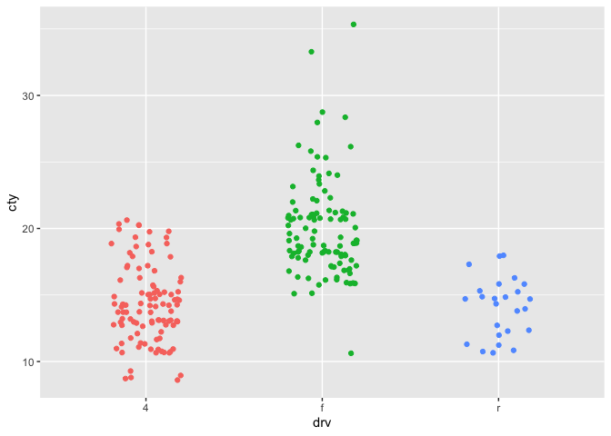
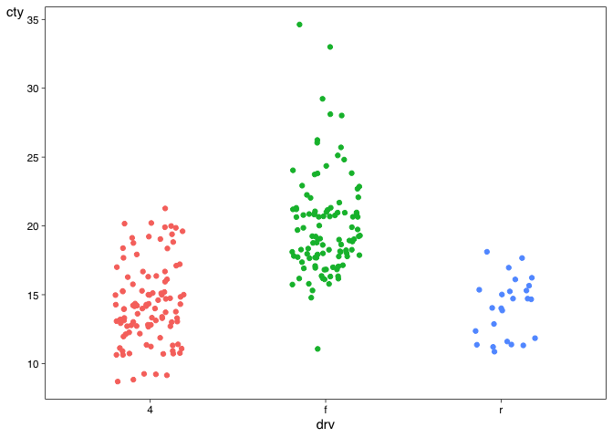
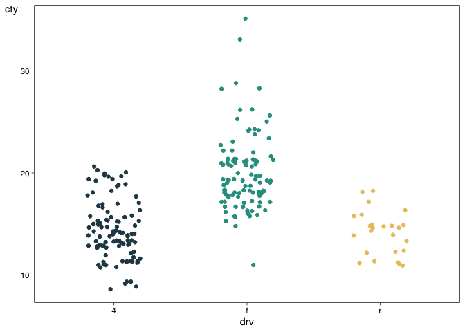
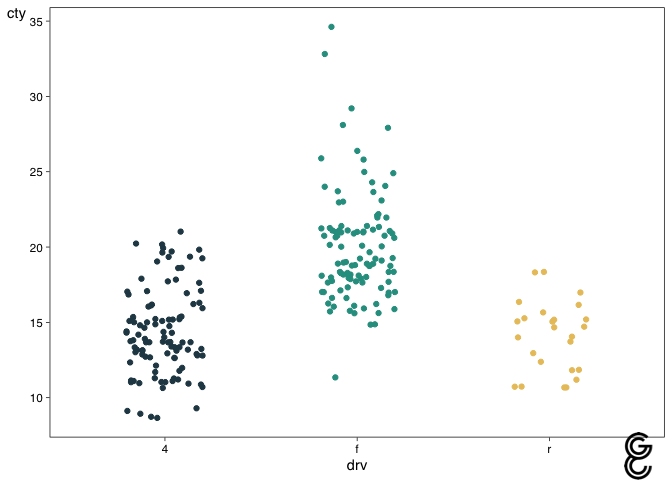
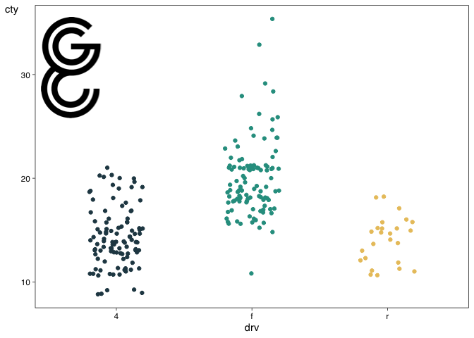

<!-- README.md is generated from README.Rmd. Please edit that file -->

# GUTSstyle

<!-- badges: start -->
<!-- badges: end -->

The goal of GUTSstyle is to give visualisations created in `ggplot2` the
GUTS-flavour. It can do three things: 1) add a GUTS-theme, 2) use a
GUTS-colour scheme, 3) add a GUTS logo.

## Installation

You can install the development version of GUTSstyle from
[GitHub](https://github.com/) with:

``` r
# install.packages("devtools")
devtools::install_github("gertstulp/GUTSstyle")
```

## Example

``` r
library(ggplot2)
#> Warning: package 'ggplot2' was built under R version 4.3.3
library(GUTSstyle)

# default ggplot2 graph
plot <- ggplot(mpg, aes(x = drv, y = cty, colour = drv)) + 
  geom_jitter(width = 0.2, show.legend = FALSE)
plot
```



Add GUTS-theme with `theme_guts`:

``` r
plot <- plot + theme_guts
plot
```



Add GUTS-colours with `scale_color_guts` or `scale_fill_guts`:

``` r
plot <- plot + scale_color_guts()
plot
```



You can also add a GUTS-logo to your graph. Note that you would need to
install and load the package `cowplot` first

``` r
library(cowplot)
add_guts_logo(plot)
```

 I
want it somewhere else and bigger:

``` r
add_guts_logo(plot, x = 0, y = 0.95, 
              width = 0.3, height = 0.3,
              hjust = 0, vjust = 1)
```


